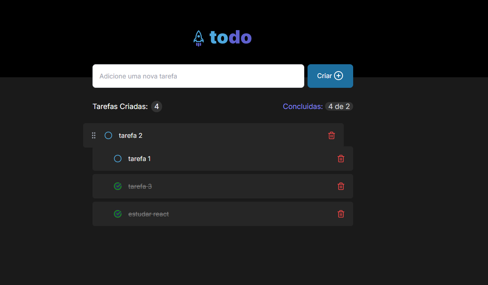

# Projeto to do list #

### objetivo ###
este projeto é um estudo de react, feito com ajuda de intelegencia artificial com a ideia de um desafio do nivel 1 do curso da Rocketseat todolis

## Descrição ###
É um sistema de tarefas basicas em listagem dinamica com um contador de tarefas e as tarefas concluidas. foi implementado a mais um sistema de Drag and Drop para reordernar as tarefas na lista



## instalação ###

para instalar o projeto basta seguir os seguintes comandos:
clonando o projeto na sua maquina:
```js
gh repo clone carlosmartos13/todolist
``` 
instale as dependencias
```js
npm install
```

Execute o projeto:

```js
npm run dev
```

para suporte me procure